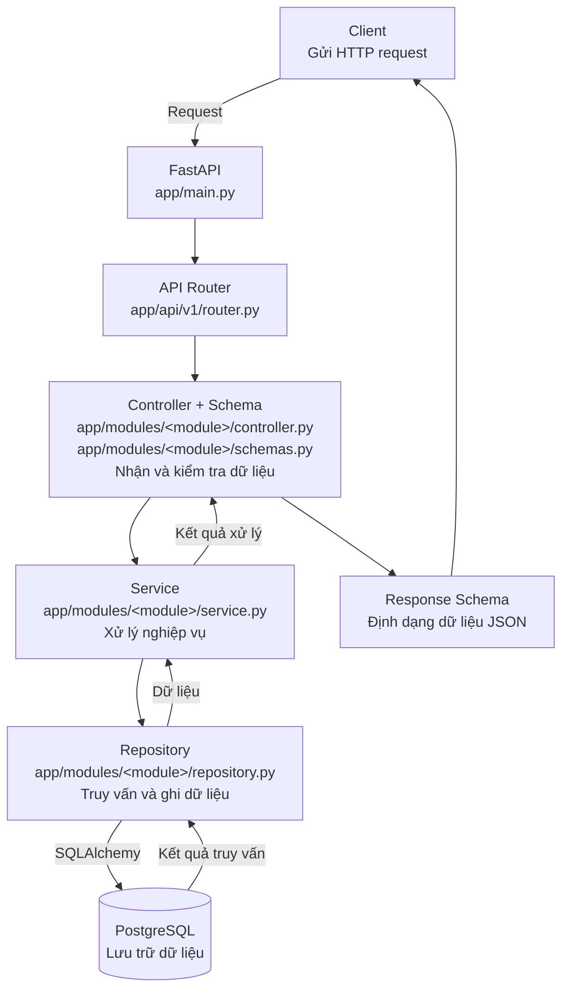

# Luồng dữ liệu trong project

```mermaid
flowchart TD
    Client["Client<br/>Gửi HTTP request"]
    App["FastAPI<br/>app/main.py"]
    API["API Router<br/>app/api/v1/router.py"]
    Router["Controller + Schema<br/>app/modules/&lt;module&gt;/controller.py<br/>app/modules/&lt;module&gt;/schemas.py<br/>Nhận và kiểm tra dữ liệu"]
    Service["Service<br/>app/modules/&lt;module&gt;/service.py<br/>Xử lý nghiệp vụ"]
    Repo["Repository<br/>app/modules/&lt;module&gt;/repository.py<br/>Truy vấn và ghi dữ liệu"]
    DB[("PostgreSQL<br/>Lưu trữ dữ liệu")]
    Response["Response Schema<br/>Định dạng dữ liệu JSON"]

    Client -->|"Request"| App
    App --> API
    API --> Router
    Router --> Service
    Service --> Repo
    Repo -->|"SQLAlchemy"| DB
    DB -->|"Kết quả truy vấn"| Repo
    Repo -->|"Dữ liệu"| Service
    Service -->|"Kết quả xử lý"| Router
    Router --> Response
    Response --> Client
```
